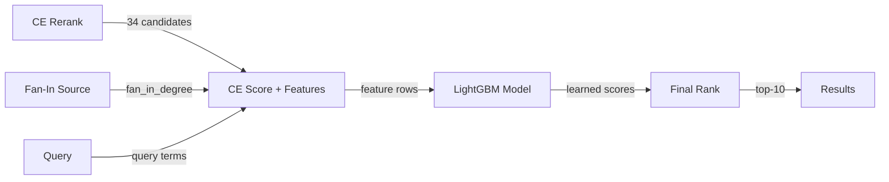

# Plan: Learned Meta-Ranker (LightGBM) for CE-stage re-ranking

**Objective**: Replace the hand-tuned `ce_score + fan_in_prior` additive formula with a LightGBM LambdaRank model trained on the full 1065-case dataset, fusing CE score, fan-in prior, lexical overlap, directory proximity, and symbol type features.

## Why this approach

The current hub prior (`ce_score + 0.04 * fan_in_prior`) is a single-feature linear adjustment. A learned model can:
- Weigh multiple signals optimally (CE score, fan-in, lexical overlap, path proximity, symbol type)
- Learn non-linear interactions (e.g., fan-in matters more when CE is uncertain)
- Be trained on the full 1065-case dataset with proper train/test split

## Architecture

## Implementation phases

### Phase 1: Feature infrastructure (new files)
1. `src/code_diver/ranking/ce_meta_feature_row.py` — feature names + row dataclass
2. `src/code_diver/ranking/ce_meta_feature_extractor.py` — extract features from (CE score, candidate, query, fan-in)
3. `src/code_diver/ranking/ce_meta_feature_collector.py` — collect + dump features
4. Add `--dump-ce-meta-features` to CLI

### Phase 2: Training script
5. `scripts/train_ce_meta_ranker.py` — LightGBM LambdaRank on CE-stage features

### Phase 3: Integration
6. Add `ce_meta_ranker_enabled`/`ce_meta_model_path` to config
7. Integrate into `cross_encoder_rerank_retrieval_strategy.py`
8. Fallback: if model missing/fails → use hub prior

### Phase 4: Train & evaluate
9. Export features from 1065-case run
10. Train LightGBM model
11. Evaluate on WHERE-78 + mech150

## Features (13 total)

| # | Feature | Source | Description |
|---|---|---|---|
| 1 | `ce_score` | CE reranker | Cross-encoder relevance score (logit) |
| 2 | `ce_score_rank` | CE rank | 1-based rank by CE score alone |
| 3 | `fan_in_prior` | HubPriorScorer | log1p(fan_in_degree) / log1p(max) |
| 4 | `role_prior` | HubPriorScorer | filename role match (Manager/Processor/Impl) |
| 5 | `base_fused_score` | Graph file stage | Fused score before CE |
| 6 | `base_fused_rank` | Base rank | 1-based rank in base order |
| 7 | `lexical_overlap` | Query + path | Fraction of query terms in path |
| 8 | `dir_depth` | Path | path.count("/") |
| 9 | `path_name_length` | Path | len(filename) |
| 10 | `is_test_path` | Path | 1 if path contains /test/ |
| 11 | `file_extension` | Path | One-hot: .java/.kt/.xml/.md/other |
| 12 | `dir_proximity` | Query + path | Fraction of directory tokens in path |
| 13 | `query_term_count` | Query | Number of query tokens |

## Expected outcome

- Replace `hub_prior_enabled` additive formula with learned model
- Maintain or improve H-89a metrics (86.1% hit@10, MRR 0.718, hit@1 63.3%)
- No regression on mech150
- Latency: model inference < 1ms per query (LightGBM C++ backend)