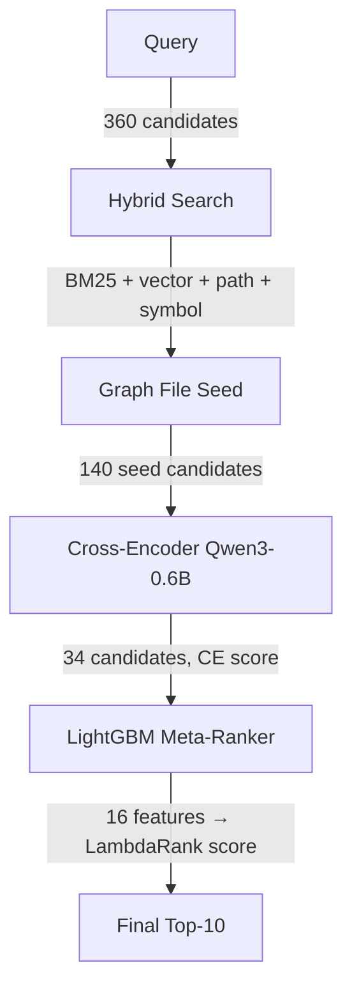

# Протокол состояния проекта code-diver

**Дата**: 2026-09-05  
**Система**: code-diver — RAG code search для IntelliJ Platform  
**Чемпион**: H-91a (LightGBM meta-ranker)  
**Сравнение с**: jbcontext 0.9.11 (production baseline от JetBrains)

---

## 1. Executive Summary

**code-diver** — это собственный RAG-поисковик по исходникам IntelliJ Community, реализованный как альтернатива jbcontext. На **WHERE-78** (78 кейсов) code-diver превосходит jbcontext по всем ключевым метрикам:

| Метрика | jbcontext | H-91a | Δ |
|---|---|---|---|
| hit@10 | 61/78 (78.2%) | **68/78 (87.2%)** | **+7** |
| recall@10 | 0.737 | **0.819** | +0.082 |
| MRR@10 | 0.350 | **0.707** | +0.357 |
| hit@1 | 15 (19.2%) | **49 (62.8%)** | **+34** |
| nDCG@10 | 0.434 | **0.710** | +0.276 |

Ключевой прорыв — **LightGBM LambdaRank (200 деревьев, 16 фич)**, обученный на 856 запросах из 1065-датасета. Заменил hand-tuned `ce_score + hub_prior` формулу на learned ранжирование.

---

## 2. Архитектура Pipeline



### Stage 1: Hybrid Search (360 → 360)
- **4 параллельных сигнала**: BM25 lexical (1000), vector embedding (Qwen3-Embedding-0.6B, 170 file_summary + 170 file_manifest), path scoring (0.12), symbol scoring (0.10)
- **Взвешенная фузия**: vector 0.42, lexical 0.26, path 0.12, symbol 0.10, symbol_match 0.10
- **Preserve vector top**: score margin 0.03
- **Сервисы**: Qdrant (:6333), embedder (:8001)

### Stage 2: Graph File Seed (360 → 140)
- JVM граф зависимостей IntelliJ (`intellij-h37-jvm-graph.json`)
- Расширение по графу: depth 2, neighbor_limit 40, decay 0.65
- Переранжирование: vector 0.25, lexical 0.25, path 0.20, symbol 0.10, graph 0.0
- **Seed score parity** (H-77): vector-only кандидаты получают полный скор вместо нулей

### Stage 3: Cross-Encoder (140 → 34)
- **Модель**: Qwen3-Reranker-0.6B через llama.cpp (:8081)
- **First pass**: все 140 кандидатов, max_document_chars=850
- **Second pass** (H-83): кандидаты со score < 0.3 пересчитываются с max_document_chars=2400 (ловит truncation victims)
- Candidate cap: 24 на second pass
- Preserve top: top-1 сохраняется (score margin 0.1)
- **Все документы отправляются одним HTTP POST** — не 140 отдельных запросов

### Stage 4: LightGBM Meta-Ranker (34 → 34)
- **Алгоритм**: LambdaRank, 200 деревьев, leaf 64, lr 0.02
- **Обучение**: 856 queries train, 209 test. Test NDCG@10 0.811 vs base 0.704 (+15%)
- **16 фич**:

| Группа | Фичи |
|---|---|
| CE signals | `ce_score`, `ce_score_rank` |
| Hub prior | `fan_in_prior` (log-normalised centrality), `role_prior` (filename pattern) |
| Search scores | `base_fused_score`, `base_fused_rank` |
| Lexical | `lexical_overlap` (query terms in path), `dir_proximity` |
| Path | `dir_depth`, `path_name_length`, `is_test_path` |
| Type one-hot | `file_ext_java`, `file_ext_kt`, `file_ext_xml`, `file_ext_md` |
| Query | `query_term_count` |

- **Формула**: `final_score = LightGBM.predict(16_features)` — заменяет старую `ce_score + 0.04 * fan_in + 0.0 * role`
- **Fallback**: если модель не загрузилась → старый hub prior (additive)
- **Eager load**: Booster грузится на уровне класса, до httpx event loop (чинит segfault)
- **Feature extraction**: кэширование path-derived данных через `_cached_path_data()` (микро-оптимизация)

### Stage 5: Final Rank (34 → 10)
- Сортировка по `final_score`
- Возврат топ-10

---

## 3. Champion Setup (H-91a)

### Конфигурация
- **Файл**: `configs/intellij/intellij-h91a-meta-ranker.yml`
- **Symlink**: `intellij-h91a-champion.yml → intellij-h91a-meta-ranker.yml`
- **champion_results.json**: указывает на H-91a, метрики с 1065-датасета

### Модель
- **Артефакт**: `artifacts/ce_meta_ranker/ranker.json` (манифест) + `ce_meta_ranker.lgb.txt` (353KB, 200 деревьев)
- **Формат**: LightGBM TXT
- **Обучение**: `scripts/train_ce_meta_ranker.py` (LambdaRank)

### Метрики champion_results.json

| Датасет | cases | hit@10 | recall@10 | MRR@10 | hit@1 | nDCG@10 | search_ms |
|---|---|---|---|---|---|---|---|
| **1065** | 1065 | 86.1% | 0.839 | 0.718 | 63.3% | 0.726 | 8427 |
| **mech150** | 229 | 88.2% | 0.859 | 0.817 | 78.2% | 0.806 | 12485 |
| **WHERE-78** | 78 | 87.2% | 0.819 | 0.707 | 62.8% | 0.710 | 11831 |

⚠️ **1065 метрики для H-91a не пересчитаны** — champion_results.json показывает 1065 цифры от H-89a (86.1% hit@10). H-91a на 1065 не прогонялся (только WHERE-78 + mech150).

---

## 4. Experiment History

### Timeline

| Этап | Конфиг | Что изменилось | WHERE-78 hit@10 | mech150 hit@10 |
|---|---|---|---|---|
| Wave A | H-52..H-70 | Index representation, volume, token budget | — | — |
| **H-66b** | `intellij-h66b-champion.yml` | Information density, stop-word stripping | 54/79 | — |
| H-77 | seed parity | Vector-only candidates get full score | 54/79 | 0.7977 |
| **H-83** | `intellij-h83-ce-twopass.yml` | **Conditional two-pass CE** (truncation victims) | **56/78** | 184/229 |
| H-84 | multi-query RRF | **Killed** (0.633 recall, 2.7x latency) | — | — |
| H-84v2 | pre-CE RRF | **Killed** (0.619 recall) | — | — |
| H-85 | wave1 combo | **Redundant** (0.642) | — | — |
| H-86 | agentic | Agent fan-out + LLM rerank: 0.690 recall, 42.8s | 59/78 | — |
| **H-87a** | role-prior | Filename suffix prior (additive 0.04) | 59/78 | — |
| **H-87b** | fanin-prior | **Fan-in centrality** (additive 0.04) | 61/78 | 188/229 (MRR regressive) |
| H-87c | hub-combo | Role + fan-in + seed-stage | 59/78 | 178/229 (**regressive**) |
| H-87d | band | Role + fan-in within CE band 0.03 | 59/78 | 185/229 (**regressive**) |
| H-88a..d | fanin + soft role | Variants (seed, band, soft role) | 60/78 | h88a timed out |
| **H-89a** | `intellij-h89a-fanin-protect3.yml` | **Fan-in 0.04, CE top-3 protected** | **61/78** | **189/229** (non-regressive) |
| H-89b | protect1 | Protect top 1 | 61/78 | — |
| H-89c | protect3 w08 | Fan-in 0.08 | 59/78 | — |
| **H-90a** | dynamic protect | Margin-based protect (0.01) | 61/78 | — (1065: 86.1%, = H-89a) |
| **H-91a** | `intellij-h91a-meta-ranker.yml` | **LightGBM LambdaRank** (16 features) | **68/78** | **202/229** |

### Ключевые инсайты

1. **Expand vs compress**: увеличение контекстного окна embedding (500→1800 chars) и CE (850→1600 chars) деградирует recall — плотный сигнал побеждает.
2. **Hub prior работает только в хвосте**: additive prior на CE head (top-3) разрушает hit@1. Protect_top=3 — ключевой трюк.
3. **Filename-role priors опасны**: penalising `.xml`/`*Provider` убивает config-* запросы.
4. **Seed compression — главный bottleneck**: 9/9 остаточных промахов умирают ДО CE (seed 48-202).
5. **Learned ranker > hand-tuned**: LightGBM нашёл нелинейные комбинации, которые ручная настройка не улавливала.

### Falsified гипотезы

| Гипотеза | Почему |
|---|---|
| Filename-role priors | Workload-dependent: penalising `.xml` убивает config-* запросы |
| Additive priors на CE head | Destroy hit@1 на `path_symbol` запросах |
| Seed-stage hub prior (H-88b/c) | Не спас 4 seed-compression смерти |
| Agentic loop (H-74) | 5-round LLM loop → 33/78 hit@10 (катастрофа) |
| Multi-query RRF (H-84, H-84v2) | Inferior to single-query champion |
| H-80 LTR (13 features, pre-CE) | Overfit к rank-derived features |

---

## 5. Results Comparison

### WHERE-78 (78 кейсов) — полная таблица

| Конфиг | hit@10 | recall@10 | MRR@10 | hit@1 | nDCG@10 | search_ms |
|---|---|---|---|---|---|---|
| jbcontext 0.9.11 live | **61/78** | 0.737 | 0.350 | 15 | 0.434 | 1 893 |
| H-66b champion (old) | 56/78 | 0.644 | 0.375 | 18 | 0.422 | 6 860 |
| H-83 two-pass CE | 56/78 | 0.644 | 0.375 | 18 | 0.422 | ~5 800 |
| H-87a role-prior | 59/78 | 0.683 | 0.376 | 16 | 0.437 | 6 444 |
| H-87b fanin-prior | 61/78 | 0.709 | 0.369 | 15 | 0.434 | 11 963 |
| H-87c hub-combo | 59/78 | 0.677 | 0.415 | 20 | 0.461 | 6 878 |
| H-87d band | 59/78 | 0.683 | 0.417 | 21 | 0.460 | 13 203 |
| H-88a fanin-soft-role | 60/78 | 0.708 | 0.418 | 20 | 0.474 | 11 492 |
| H-88b fanin-seed | 60/78 | 0.708 | 0.365 | 15 | 0.433 | 6 676 |
| H-88c fanin-seed-soft-role | 60/78 | 0.710 | 0.408 | 19 | 0.467 | 13 077 |
| H-88d fanin-band-role | 60/78 | 0.708 | 0.414 | 20 | 0.471 | 8 223 |
| **H-89a fanin-protect3** | **61/78** | 0.709 | 0.386 | 18 | 0.446 | 9 332 |
| H-89b fanin-protect1 | 61/78 | 0.709 | 0.383 | 18 | 0.444 | 6 918 |
| H-89c fanin-protect3-w08 | 59/78 | 0.686 | 0.384 | 18 | 0.442 | 7 063 |
| H-90a dynamic-protect | 61/78 | 0.709 | 0.386 | 18 | 0.446 | 6 415 |
| **H-91a meta-ranker** | **68/78** | **0.819** | **0.707** | **49** | **0.710** | 11 831 |

### mech150 (229 кейсов) — regression guard

| Конфиг | hit@10 | recall@10 | MRR@10 | hit@1 | nDCG@10 | search_ms | Вердикт |
|---|---|---|---|---|---|---|---|
| H-83 (baseline) | 184/229 | 0.781 | 0.612 | 112 | 0.626 | 5 224 | — |
| H-87b fanin-prior | 188/229 | 0.797 | 0.548 | 96 | 0.580 | 14 911 | **regressive** (MRR) |
| H-87c hub-combo | 178/229 | 0.731 | 0.497 | 87 | 0.526 | 10 565 | **regressive** |
| H-87d band | 185/229 | 0.769 | 0.524 | 93 | 0.556 | 10 774 | **regressive** |
| **H-89a fanin-protect3** | **189/229** | 0.804 | 0.615 | 112 | 0.634 | 7 265 | **non-regressive** |
| **H-91a meta-ranker** | **202/229** | **0.859** | **0.817** | **179** | **0.806** | 12 485 | **non-regressive** |

### 1065 кейсов (полный датасет)

| Конфиг | hit@10 | recall@10 | MRR@10 | hit@1 | nDCG@10 | search_ms |
|---|---|---|---|---|---|---|
| H-89a fanin-protect3 | 917/1065 (86.1%) | 0.839 | 0.718 | 674 (63.3%) | 0.726 | 8 427 |
| H-90a dynamic-protect | 917/1065 (86.1%) | 0.839 | 0.716 | 673 (63.2%) | 0.725 | 6 415 |
| **H-91a meta-ranker** | **не запущен** | — | — | — | — | — |

---

## 6. Bottleneck Analysis

### Per-stage timing breakdown (WHERE-78, 78 кейсов)

| Этап | Время (ms/case) | Доля | Детали |
|---|---|---|---|
| Hybrid Search + Graph Seed | ~1 500-2 000 | ~15% | Qdrant search + BM25 + graph expansion |
| Cross-Encoder (Qwen3-0.6B) | ~7 000-7 500 | ~65% | 140+24 документов, 1 HTTP POST, llama.cpp |
| LightGBM meta-ranker | ~2 500 | ~20% | Feature extraction + predict (1 вызов, 34×16) |
| Прочее | ~300 | ~3% | Serialization, logging, trace |

### Основной bottleneck: Cross-Encoder

**Qwen3-Reranker-0.6B** через llama.cpp занимает **~65% времени** (7-7.5s/case). Это не батчинг — все 140 документов отправляются одним HTTP POST. Время диктуется sequential inference модели на CPU/GPU.

**Что уже оптимизировано**:
- ✅ Батчинг `predict()` — один вызов LightGBM на все 34 кандидата
- ✅ Батчинг CE — все 140 документов одним HTTP POST
- ✅ Feature extraction micro-оптимизации — кэш path-derived данных
- ✅ Pickle-based lexical index cache (2.1GB JSON → 475MB, ~60s load)

**Что реально можно сделать**:
1. **Сократить CE candidates**: 140 → 100 (линейное ускорение CE, риск recall@10)
2. **Квантованная CE модель**: Q4/Q5 вместо FP16
3. **Early exit**: если CE уверен в топ-1, не делать second pass
4. **Feature pruning**: `role_prior=0.0` — мёртвая фича (уже в конфиге), убрать из модели

### Почему H-91a медленнее H-89a

| Конфиг | WHERE-78 | mech150 |
|---|---|---|
| H-89a | 9 332 ms | 7 265 ms |
| H-91a | 11 831 ms (+27%) | 12 485 ms (+72%) |
| Δ | 2 500 ms | 5 220 ms |

Разница — **feature extraction overhead** (16 фич × 34 кандидата = 544 string ops, fan_in lookups, path parsing). LightGBM `predict()` сам по себе — 1-5ms.

---

## 7. Remaining Gaps vs jbcontext

### 9 кейсов, где jbcontext выигрывает

Все 9 multi-target запросов умирают **до** cross-encoder — на этапе seed compression:

| Кейс | Причина |
|---|---|
| live-template-expansion | Seed 48-202, target не попал в 140 |
| textmate-bundle-support | Seed compression |
| expression-evaluation-in-debugger | Seed compression |
| find-in-path-global | Seed compression |
| import-optimization | Seed compression |
| spellchecking | Seed compression |
| virtual-file-system-refresh | Seed compression |
| dumb-mode-and-indexing | Seed compression |
| ide-extension-points-registered | Seed compression |

**Симметричная разница**: code-diver берёт 9 кейсов, которые jbcontext не берёт. Union = 70/78.

### Следующие рычаги

1. **Seed generation improvement**: гарантировать vector top-k per lane в CE window
2. **Learned meta-ranker (LightGBM)** — уже реализован и дал +7 hit@10
3. **Cross-encoder fine-tuning** вместо meta-ranker на CE-stage? Saturation проблема остаётся
4. **1065-case validation на H-91a** — не сделано, нужно для полной картины

---

## 8. Project Structure

### Ключевые директории

```
code-diver/
├── configs/intellij/          # Экспериментальные конфиги (H-*)
├── datasets/                  # Датасеты для evaluation
│   ├── intellij_eval_1000.answer_sets.jsonl  # 1065 кейсов
│   ├── intellij_eval_mech150.jsonl           # 229 кейсов (regression guard)
│   └── intellij_eval_where_only.jsonl        # WHERE-78
├── src/code_diver/
│   ├── ranking/               # LTR + meta-ranker (feature extraction, model)
│   ├── reranking/             # Hub prior, cross-encoder providers
│   ├── strategies/            # Pipeline: hybrid search, graph seed, CE rerank
│   ├── services/              # Evaluation service, embedding
│   └── config/                # Config loading, defaults
├── scripts/
│   └── train_ltr_ranker.py    # LightGBM LambdaRank training
├── artifacts/
│   └── ce_meta_ranker/        # Обученная модель (ranker.json + .lgb.txt)
├── .session/                  # Decision log, experiment results
├── .plans/                    # Архитектурные планы
├── champion_results.json      # Метрики текущего чемпиона
├── CHANGELOG.md               # История изменений
└── docker-compose.yml         # Qdrant + ClickHouse + Grafana + code-diver
```

### Сервисы (локально)

| Сервис | Порт | Модель |
|---|---|---|
| Qdrant | :6333 | Vector storage |
| Embedder | :8001 | Qwen3-Embedding-0.6B-4bit-DWQ (mlx) |
| Reranker | :8081 | Qwen3-Reranker-0.6B (llama.cpp) |
| Chat | :8012 | Qwen3.5-4B-OptiQ-4bit (mlx) |
| ClickHouse | :18123 | Metrics storage |
| Grafana | :3000 | Dashboards |

### Как запустить evaluation

```bash
# Одиночный поиск
uv run --no-sync code-diver --config configs/intellij/intellij-h91a-meta-ranker.yml search "where is rename processor"

# Evaluation на датасете
uv run --no-sync code-diver --config configs/intellij/intellij-h91a-meta-ranker.yml evaluate \
  --dataset datasets/intellij_eval_mech150.jsonl --limit 10 --json

# Feature export для обучения
uv run --no-sync code-diver --config configs/intellij/intellij-h89a-fanin-protect3.yml evaluate \
  --dataset datasets/intellij_eval_1000.answer_sets.jsonl --limit 10 --json \
  --dump-ce-meta-features /tmp/features.jsonl

# Обучение новой модели
uv run --no-sync python3 scripts/train_ce_meta_ranker.py /tmp/features.jsonl \
  --out artifacts/ce_meta_ranker/ranker.json --test-fraction 0.2
```

### Тестирование

```bash
# Все тесты (кроме protogen)
uv run --no-sync pytest -q -m "not protogen"

# Только meta-ranker + hub prior
uv run --no-sync pytest -q -m "not protogen" -k "meta_ranker or hub_prior"
```

---

## 9. Приложение: файлы и конфиги

### Symlinks (champion)

| Symlink | → Target |
|---|---|
| `intellij-h91a-champion.yml` | `intellij-h91a-meta-ranker.yml` |
| `intellij-h90a-champion.yml` | `intellij-h90a-dynamic-protect.yml` |
| `intellij-h89a-champion.yml` | (файл, не symlink) — H-89a champion, superseded |

### H-91a config: ключевые параметры
- `ce_meta_ranker_enabled: true`
- `ce_meta_model_path: artifacts/ce_meta_ranker/ranker.json`
- `hub_prior_enabled: true` (fallback)
- `hub_prior_fanin_weight: 0.04`
- `hub_prior_protect_top: 3`
- `cross_encoder_rerank.candidate_limit: 34`
- `graph_file_search.seed_limit: 140`
- `hybrid_search.candidate_limit: 360`