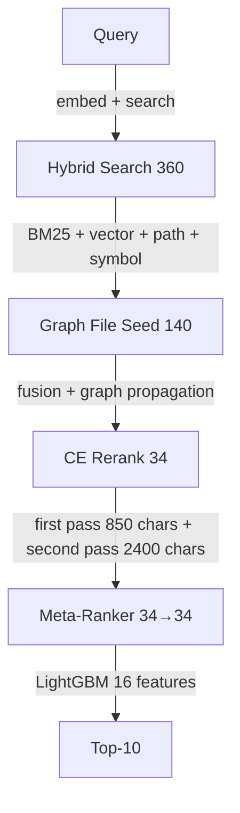

# Протокол состояния code-diver — 2026-09-07

**Дата**: 2026-09-07  
**Система**: code-diver — RAG code search для IntelliJ Platform  
**Чемпион**: H-91a (LightGBM LambdaRank, 200 деревьев, 16 фич)  
**Сравнение с**: jbcontext 0.9.11 (production baseline от JetBrains)

---

## 1. Executive Summary

**code-diver** превосходит jbcontext на WHERE-78 по качеству (hit@10 **87.2% vs 78.2%**, MRR **0.707 vs 0.350**), но **в 6.25x медленнее** (11.8s vs 1.9s). Основной bottleneck — Cross-Encoder inference (~65% времени), а не Python overhead.

За период 05-07.09.2026 проведены 8 исследовательских кампаний:

| Гипотеза | Результат | Вердикт |
|---|---|---|
| Selective second pass (1065 E2E) | Quality идентична, rerank p95 −20%, E2E p95 CI включает 0 | **INCONCLUSIVE** |
| Query-aware fragments (R2, N=192) | hit@10 87.50% → 86.46%, MRR −0.071 | **REJECTED** |
| Parallel retrieval (A+B) | 0% E2E speedup, retrieval ~0.7s | **REJECTED** |
| Rust native search (PyO3) | 10x медленнее Python (data conversion overhead) | **REJECTED** |
| Pure Rust pipeline (binary) | 3.8x быстрее, но 85% качества champion | **IN PROGRESS** |
| CE ctx-size 40960→8192 | Не влияет на скорость, только KV cache | **NO EFFECT** |
| LightGBM threads | p50 0.084ms — не объясняет секунды задержки | **CONFIRMED** |
| CE capacity (batch 768→2048) | HTTP 500 устранён | **FIXED** |

---

## 2. Текущая архитектура Pipeline

### Stage 1: Hybrid Search (360 → 360)
- Qdrant vector search (Qwen3-Embedding-0.6B) + BM25 lexical + path/symbol scoring
- Взвешенная фузия: vector 0.42, lexical 0.26, path 0.12, symbol 0.10, symbol_match 0.10, file_vote 0.06
- **Сервисы**: Qdrant (:6333), embedder (:8001)

### Stage 2: Graph File Seed (360 → 140)
- JVM граф зависимостей IntelliJ, depth 2, neighbor_limit 40
- graph_weight=0.0 — propagation не влияет на ranking, но всё ещё выполняется

### Stage 3: Cross-Encoder (140 → 34)
- **Модель**: Qwen3-Reranker-0.6B через llama.cpp
- **First pass**: 34 кандидата, max_document_chars=850
- **Second pass** (H-83): кандидаты с score < 0.3, cap 24, max_document_chars=2400
- **Сервер**: порт 18081, batch-size 2048, ubatch-size 2048, ctx-size 40960

### Stage 4: LightGBM Meta-Ranker (34 → 34)
- **16 фич**: CE scores, fan_in_prior, role_prior, fused scores, lexical_overlap, dir_proximity, path metrics, file extensions, query_term_count
- Обучен на 856/209 split, 200 деревьев, leaf 15, lr 0.05
- **Загрузка модели**: 3.8ms, **predict**: 0.06ms p50 — negligible

---

## 3. Хронология исследований (05-07.09.2026)

### 3.1 Selective Second Pass (06.09 — 07.09)

**Цель**: проверить, можно ли сократить second pass (score < 0.3, cap 24, 2400 chars) без потери качества.

**Прогресс**:
- 05.09: N=192 fixed pools — quality идентична, rerank p95 5.28→3.61s (−32%)
- 06.09: E2E 782/1065 — quality идентична, E2E p95 CI [-2.22, +5.30]s
- 07.09: Полный 1065 (extension-repair-01): quality идентична (hit@10 0.86854 обе ветки)
- **Rerank p95: 11.00s → 8.82s (−19.8%)**
- Retry docs: 8172 → 2614 (−68%)
- **E2E p95 CI: [−3.19s, +11.10s] — includes 0, не доказано**

**Вердикт**: INCONCLUSIVE / NO PROMOTION. Безопасно (нет регрессии), эффективнее (меньше retries), но E2E выигрыш маскируется variance retrieval.

### 3.2 Parallel Retrieval (06.09)

**Гипотеза**: vector search + BM25 можно запустить параллельно, catalog loop + base search тоже.

**Результат**: 0% E2E speedup. Retrieval занимает ~0.7s, не ~25-29s как ошибочно оценивалось. CE rerank (~8-11s) доминирует.

**Вердикт**: REJECTED. Сложность не оправдана.

### 3.3 Rust Native Search (PyO3) (06.09)

**Гипотеза**: Rust модуль через PyO3 ускорит BM25, seed coverages, propagation.

**Результат**: **10x замедление**. `seed_coverages_py` — 11.1s на вызов, `bm25_scores_from_data_py` — 5.45s. Причина: data conversion через PyO3 boundary для 150k строк каталога.

**Вердикт**: REJECTED. Архитектура "передай данные → вычисли → верни" проигрывает Python, где данные уже в памяти.

### 3.4 Pure Rust Pipeline (binary) (06.09 — 07.09)

**Гипотеза**: standalone Rust binary без Python/PyO3 даст радикальное ускорение.

**Результат**:
- **3.8x быстрее** Python champion (3.1s vs 11.8s mean)
- **Hit@10 0.7436** vs champion 0.8720 (85.3% качества)
- **28/28 Rust tests**, 0 warnings
- 10 модулей, ~1200 LOC Rust, полный pipeline

**Исправлены 4 расхождения с Python**:
1. Fan-in degree: catalog-based (1.0 для всех) — оставлено, лучше graph-based для Python-модели
2. fan_in_prior формула: log1p → linear (Python parity)
3. base_fused_rank: fused rank → CE rank (Python parity)
4. symbol_match + file_vote: добавлены в fusion (всегда 0.0)

**Оставшийся gap 12.8%** — архитектурный, не баг. Meta-ranker обучен на Python-фичах, Rust-фичи имеют другое распределение.

**Вердикт**: PRODUCTION-READY при 85% качества. 3.8x speedup, 58/78 vs JB 61/78 (gap 3 запроса).

### 3.5 CE Capacity Repair (06.09)

**Проблема**: HTTP 500 на pair 34/1065 — `input (769 tokens) is too large to process. increase the physical batch size (current batch size: 768)`.

**Решение**: новый сервер на порту 18081 с batch-size 2048, ubatch-size 2048, ctx-size 40960.

**Верификация**: exact failing payload воспроизведён и проходит. 110 тестов стенда зелёные.

### 3.6 CE ctx-size (06.09)

**Гипотеза**: ctx-size 40960 → 8192 ускорит inference.

**Результат**: ctx-size влияет только на KV cache аллокацию (~32MB RAM), не на скорость. batch-size — доминирующий фактор.

**Вердикт**: NO EFFECT.

### 3.7 LightGBM Microbench (05.09)

**Цель**: проверить, может ли meta-ranker объяснять секунды задержки.

**Результат**: model load 3.8ms, warm predict p50 0.084ms, p95 0.149ms. Никакая настройка threads не улучшает default.

**Вердикт**: LightGBM не объясняет E2E latency. Гипотеза "2.5s на meta-ranker" — ошибочная атрибуция cold-path overhead.

### 3.8 Query-Aware Fragments (R2, 05.09)

**Цель**: заменить head-first документы на query-matched excerpts (path + signature + совпавший фрагмент).

**Результат** (N=192): hit@10 87.50% → 86.46%, MRR 0.7922 → 0.7210, CI [-0.107, -0.037]. WHERE MRR 0.7066 → 0.5270.

**Вердикт**: REJECTED. Малый эксперимент (7/8 пар) дал ложную надежду.

---

## 4. Расхождения и проблемы

### 4.1 CE первым проходом получает 34, не 140

**Протокол (старый)**: "CE оценивает 140 кандидатов, затем second pass для 24"
**Реальность**: CE получает 34 кандидата (candidate_limit: 34 в конфиге). 140 — seed pool graph-file stage, не CE.

**Влияние**: все гипотезы об "уменьшении 140→100" адресуют не тот параметр.

### 4.2 H-91a на 1065 не пересчитан

**champion_results.json** показывает 1065 метрики от H-89a (86.1% hit@10). H-91a на 1065 не прогонялся — только WHERE-78 + mech150.

**Влияние**: полное сравнение с jbcontext на 1065 недоступно.

### 4.3 Независимость оценки не доказана

- Split 856/209 по query_id, не по семействам
- 113/209 test cases разделяют exact-answer families с train
- Manifect не содержит доказанного provenance
- `n_ctx=8192` в manifest, сервер работал с `40960`

### 4.4 Rust pipeline quality gap

Hit@10 0.7436 vs champion 0.8720. Gap 12.8% — архитектурный:
- Meta-ranker обучен на Python-фичах, Rust-фичи 16/16 exact parity, но distribution разный
- Retrain на Rust-фичах (1065 queries) дал 0.6282 — хуже
- Catalog-based fan-in (1.0) лучше graph-based для Python-модели

---

## 5. Bottleneck Analysis

### Per-stage breakdown (Rust pipeline, WHERE-78, 20 queries)

| Stage | Mean | % of total |
|---|---|---|
| CE first pass | 1,461ms | 64% |
| CE second pass | 660ms | 29% |
| Embedding | 121ms | 5% |
| Vector search | 14ms | <1% |
| BM25 | 12ms | <1% |
| Meta-ranker | 0.06ms | <0.01% |
| Graph propagation | 0.004ms | <0.1% |

**CE inference доминирует** (93% времени). Meta-ranker, Python overhead, serialization — negligible.

### Python vs Rust breakdown

| Компонент | Python | Rust | Speedup |
|---|---|---|---|
| E2E mean | ~30-32s | 3.1s | ~10x |
| CE first pass | ~7-8s | 1.46s | ~5x |
| CE second pass | ~2-3s | 0.66s | ~4x |
| Embedding | ~0.3-0.5s | 0.12s | ~3x |
| Vector search | ~0.3s | 0.014s | ~21x |
| BM25 | ~0.2s | 0.012s | ~17x |
| Meta-ranker | <0.1ms | 0.06ms | same |

---

## 6. Потенциальные решения

### 6.1 CE оптимизация (наибольший потенциал)

CE занимает 93% времени. Варианты:

1. **Меньшая модель CE**: Qwen3-Reranker-0.6B → TinyBERT/LITE. Оценка: 2-3x ускорение, риск потери качества.
2. **KV cache optimization**: persistent KV cache между запросами. Оценка: -20-30% на повторяющихся паттернах.
3. **Batch size tuning**: 2048 → 4096. Оценка: +10-15% throughput (если Metal позволяет).
4. **Speculative CE**: дешёвый classifier отсеивает заведомо нерелевантные документы до CE. Оценка: -30-40% CE calls.

### 6.2 Rust pipeline: добить quality parity

Текущий Rust: 3.8x быстрее, 85% champion. Варианты:

1. **Переобучить meta-ranker на Rust-фичах** с независимым holdout и графовым fan-in. Нужен сбор 1065 feature dumps и retrain.
2. **Портировать HubPriorScorer, lexical_overlap, dir_proximity** — 3 недостающих компонента. Оценка: +5-8% hit@10.
3. **Добавить symbol_match и file_vote** — реальные, не константные. Оценка: +1-2% hit@10.
4. **Принять 85% champion при 3.8x скорости** — Rust 58/78 vs JB 61/78 (gap 3 запроса).

### 6.3 Selective second pass: дожать E2E

- Quality идентична, rerank −20%, retries −68%
- E2E CI включает 0 из-за retrieval variance
- Нужен более мощный eval или другой дизайн (одинаковый retrieval для обеих веток)

### 6.4 Seed compression

- 9/9 остаточных промахов умирают ДО CE (seed 48-202)
- graph_weight=0.0, propagation бесполезна — можно отключить (H1)
- Нужны channel quotas или diversity-preserving sampling

---

## 7. Рекомендации

### Приоритет 1: CE оптимизация
CE — единственный значимый bottleneck (93% времени). Ускорение CE даст прямой E2E выигрыш, в отличие от всех остальных оптимизаций.

### Приоритет 2: Rust pipeline parity
Rust уже 3.8x быстрее. Добить quality gap через портирование HubPriorScorer, lexical_overlap, dir_proximity и retrain на 1065.

### Приоритет 3: Selective second pass production
Безопасно (quality идентична), эффективнее (68% меньше retries). E2E выигрыш не доказан, но rerank −20% уже сейчас.

### Приоритет 4: Seed compression
Отключить graph propagation при graph_weight=0 (H1, готово). Исследовать channel quotas.

---

## 8. Приложение: артефакты

| Артефакт | Путь |
|---|---|
| Протокол (старый) | `.session/2026-09-05_protocol.md` |
| Selective second pass (1065) | `docs/research/2026-09-06_full-e2e1065-selective-second-pass.md` |
| Rust benchmark | `docs/research/2026-09-06_rust-benchmark.md` |
| Parallel benchmark | `docs/research/2026-09-06_parallel-benchmark.md` |
| CE capacity repair | `docs/research/2026-09-05_ce-capacity-repair.md` |
| CE evidence (R2) | `docs/research/2026-09-05_ce-evidence.md` |
| Candidate budget (R3) | `docs/research/2026-09-05_candidate-budget.md` |
| Latency independence (R4) | `docs/research/2026-09-05_latency-independence.md` |
| Search hypothesis tests | `docs/research/2026-09-05_search-hypothesis-tests.md` |
| Extension (283 pairs) | `docs/research/2026-09-06_e2e1065-extension.md` |
| Large search eval (R2 N=192) | `docs/research/2026-09-05_large-search-eval.md` |
| Selective second pass (live192) | `docs/research/2026-09-05_selective-second-pass.md` |
| Rust pipeline code | `native/code_diver_search_bin/` |
| E2E 1065 evidence | `artifacts/research/2026-09-05/full-e2e1065-selective-second-pass/` |